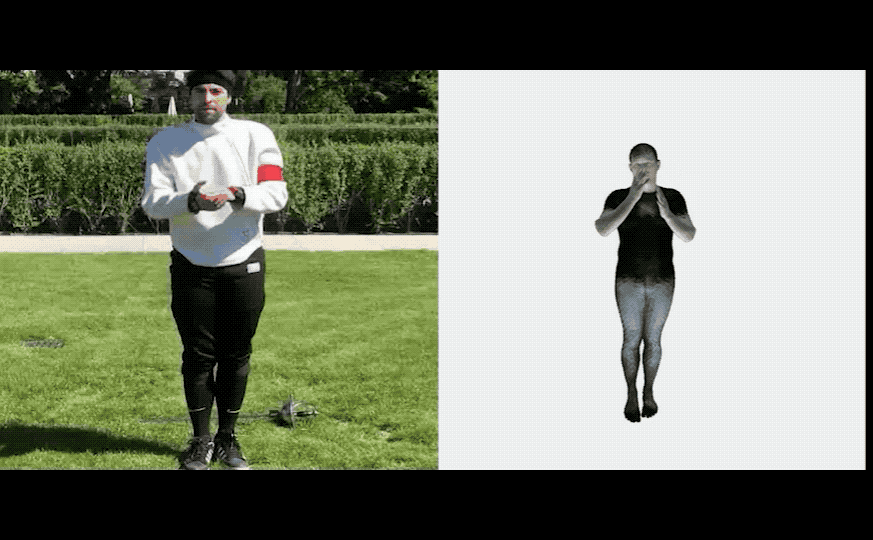

# MEVA: 3D Human Motion Estimation via Motion Compression and Refinement 


[](https://arxiv.org/abs/2008.03789)
[](https://paperswithcode.com/sota/3d-human-pose-estimation-on-3dpw?p=3d-human-motion-estimation-via-motion)

---


<div float="center">
  
</div>


**3D Human Motion Estimation via Motion Compression and Refinement**

Zhengyi Luo, S. Alireza Golestaneh, Kris M. Kitani

**ACCV 2020, Oral**  
[[Project website](https://zhengyiluo.github.io/projects/meva/)][[Quantitative Demo](https://youtu.be/YBb9NDz3ngM)][[10min Talk](https://youtu.be/-TN3NRpCEc0)]


## Notable

MEVA (Motion Estimation vis Variational Autoencoding) is a video-based 3D human pose estimation method that focus on producing **stable** and **natural-looking** human motion from videos. MEVA achieves state-of-the-art human pose estimation accuracy while reducing acceleration error siginificantly. Pleaser refer to our [paper](https://arxiv.org/abs/2008.03789) for more details.  


## Updates
- November 11, 2020 – 14:16 Inference code finished.

## Getting Started

### Install:
#### Environment
- Tested OS: Linux
- Python >= 3.6

### How to install
Install the dependencies:
```
cat requirements.txt | xargs -n 1 pip install
```

(The requirements need to installed in certian order)

### Running inference/Demo

#### Prepare necessary data
To run pre-trained models, please run the script:
```
bash scripts/prepare_data.sh
```

Command:

```
python scripts/run_meva_on_video.py --cfg train_meva_2  --vid_file zen_talking_phone.mp4  --output_folder results/output --exp train_meva_2
```

## Training 

Training code coming soon!

### Prepare Datasets
Coming soon!

## Evaluation

Here we compare MEVA with recent state-of-the-art methods on 3D pose estimation datasets. Evaluation metric is
Procrustes Aligned Mean Per Joint Position Error (PA-MPJPE) in mm.

| Models         | 3DPW &#8595; | MPI-INF-3DHP &#8595; | H36M &#8595; |
|----------------|:----:|:------------:|:----:|
| SPIN           | 59.2 |     67.5     | **41.1** |
| Temporal HMR   | 76.7 |     89.8     | 56.8 |
| VIBE           | 56.5 |     63.4     | 41.5 |
| MEVA           | **51.9** |     **62.6**     | 48.1 |

(The numbers here reflect the current state of this repo, so it might be different from what's in the paper. I did a couple of small improvment to code so it achieved better performance. The changes:
1. I used an overlapping temporal window when processing the video frames, which largly eliminate the issue introduced at the 3 second transition described in the paper. 
2. I used a new VAE architecture where the VAE does not take in the initial frame and only reconstructs motion from the latent code. 
)

Eval code coming soon!

## Known issues
1. Visulization scale seems off somehow (the humanoid is not scaled properly), still debugging!


## Citation
If you find our work useful in your research, please cite our paper [MEVA](https://arxiv.org/abs/2008.03789):
```
@InProceedings{Luo_2020_ACCV,
    author    = {Luo, Zhengyi and Golestaneh, S. Alireza and Kitani, Kris M.},
    title     = {3D Human Motion Estimation via Motion Compression and Refinement},
    booktitle = {Proceedings of the Asian Conference on Computer Vision (ACCV)},
    month     = {November},
    year      = {2020}
}
```


## References:
Notice that this repo builds upon a number of previous great works (especially, [VIBE](https://github.com/mkocabas/VIBE)), and borrow scripts from them for convenience. Since MEVA focuses on using a pre-trained VAE on [AMASS](https://amass.is.tue.mpg.de/) to breakdown human pose estimation into its coarase-to-fine elements, so the visual training part is heavily borrowed from [VIBE](https://github.com/mkocabas/VIBE). For each file that is borrowed, we indicate that it is referenced and please adhere to their liscnece for usage. 

- Dataloaders, part of the loss function, data pre-processing are from: [VIBE](https://github.com/mkocabas/VIBE) 
- SMPL models and layer is from: [SMPL-X model](https://github.com/vchoutas/smplx)
- Feature extractors are from: [SPIN](https://github.com/nkolot/SPIN)
- NN modules are from (khrylib): [DLOW](https://github.com/Khrylx/DLow)
